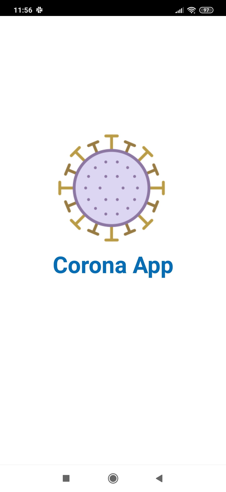
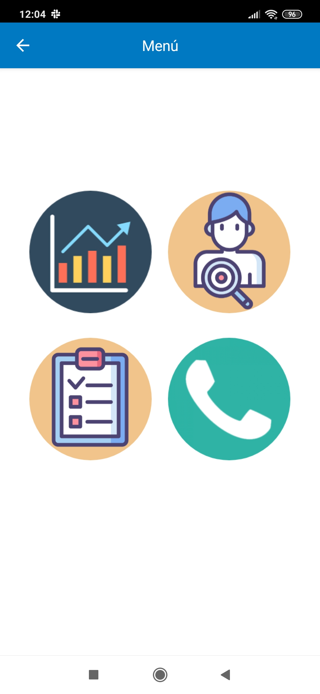
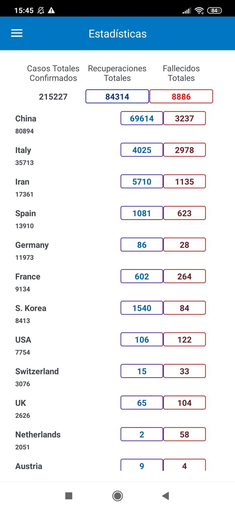
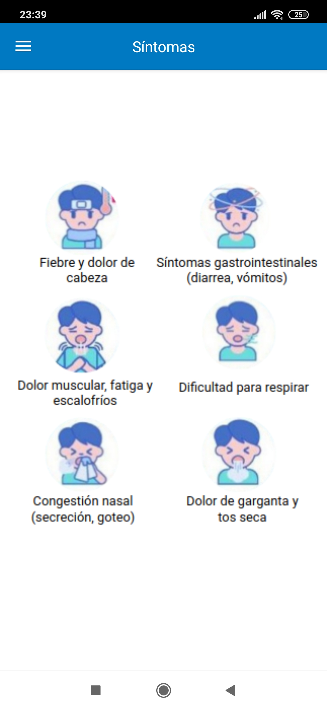
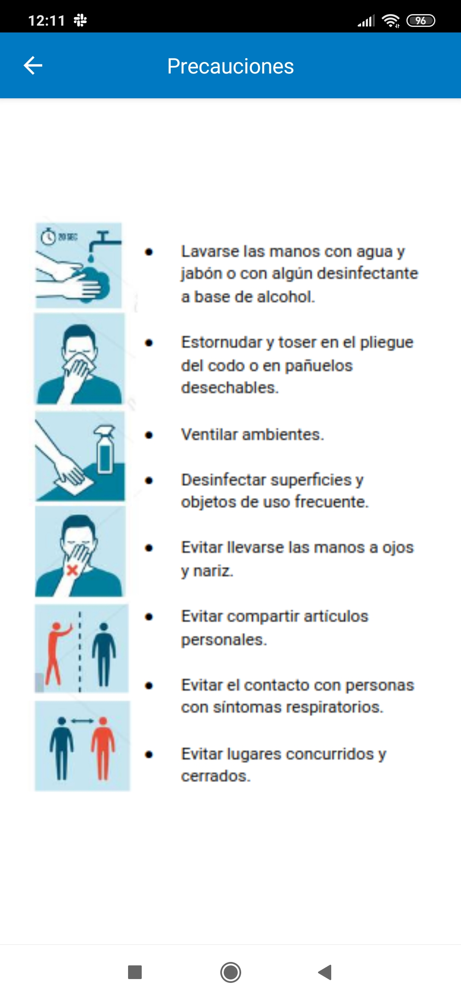
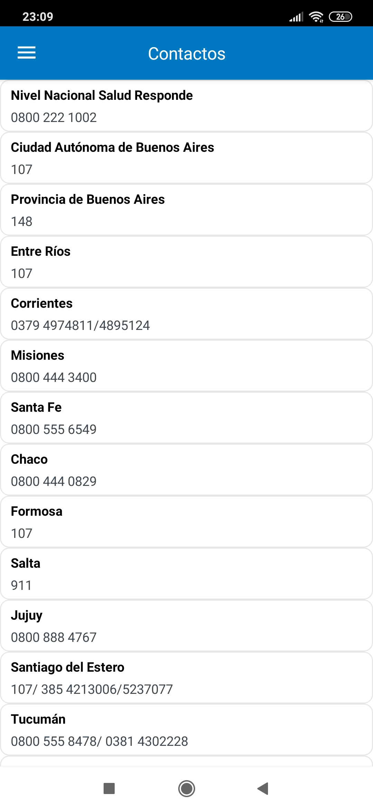

# mat|r Corona App
Data and code of Corona App, a mobile application that I developed with [mat|r script](https://www.matrproject.com/)  for Android and iOS devices.

This app lists the symptoms, precautions, contact numbers (in Argentina) and number of cases, deaths and recoveries by country and worldwide for the COVID-19 pandemic.

**Programming Language:** mat|r script

**Test App:** download the [mat|r Viewer](http://matrproject.com/docs/eng/viewer-eng/), a tool which allows you visualizing and testing the developed app instantly in compatible platforms. Visualize the app on your phone scanning the following QR code with mat|r Viewer:

**Author:** Agustina Dinamarca (agustinadinamarca@gmail.com)

